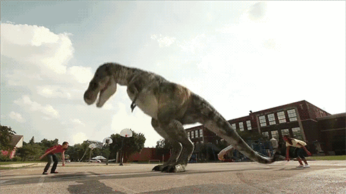

# web基础概念

## 01. 万维网

- www其实是**World Wide Web** 的缩写，它是一个由许多互相链接的超文本组成的系统，通过互联网访问。在汉语中，www 被翻译成“万维网” 。

  

- www由两部分构成：**www客户端和www服务端**。www客户端指的是个人设备（电脑、手机等）装的浏览器。www服务端指的是服务器（一台可以放许多文档的电脑）的程序。www经常被简称作web,所以www客户端、www服务端又叫web客户端、web服务端

  

- 让WEB客户端访问web服务端，从而获得网页。

- 使用http协议传送数据，通过互联网通信。

  

## 02. HTTP协议简要工作流程

- HTTP，又被称为超文本传输协议（http，hypertext transfer protocol)是互联网上应用最为广泛的一种网络协议。所有的WWW文件都必须遵守这个标准。设计HTTP最初的目的是为了提供一种发布和接收HTML页面的方法。

- 浏览网页时在浏览器地址栏中输入的URL前面都是以"http://"开始的。HTTP定义了信息如何被格式化、如何被传输，以及在各种命令下服务器和浏览器所采取的响应。

- 工作流程： （1）建立连接：web客户端发送建立连接的请求，web服务端作出响应。 （2）发送请求：web客户端发送请求内容。 （3）作出应答：web服务端回复html文件。 （4）关闭连接：web客户端收到文件就关闭连接。

  

## 03. 域名

- 域名（英语：Domain Name），简称域名、网域，是由一串用点分隔的名字组成的Internet上某一台计算机或计算机组的名称，用于在数据传输时标识计算机的电子方位（有时也指地理位置）。

- 网域名称系统（DNS，Domain Name System，将域名和IP地址相互映射的一个分布式数据库）是因特网的一项核心服务，它作为可以将域名和IP地址相互映射的一个分布式数据库，能够使人更方便地访问互联网，而不用去记住能够被机器直接读取的IP地址数串。

- [www.wikipedia.org是一个域名，和IP地址208.80.152.2相对应。DNS就像是一个自动的电话号码簿，我们可以直接拨打wikipedia的名字来代替电话号码（IP地址）。我们直接调用网站的名字以后，DNS就会将便于人类使用的名字（如www.wikipedia.org）转化成便于机器识别的IP地址（如208.80.152.2）。](http://www.wikipedia.xn--org%2Cip208-x75nool79chqbq6r4g07gu71h.80.152.xn--2-fi2bz0ft32b.xn--dns%2Cwikipedia(ip)-ss50a2wo6i6a7mr67bo8kw4h4foa82d214eznay06h0xfio8ch3b8uin0h4k0as8gv6dt35qxa951lta920cyxo0a9212c136c540f2a.xn--%2Cdns(www-m20mgo7ovc74ai8bm1au71ckai946xvlima859ah2ab54hviii02jpa248gqa454aex7bvtlbywdv2h.wikipedia.xn--org)ip(208-gp3pl8iluk6mdmyrs5c1hr58aum6bruvqm7ewz3eusra.80.152.2)./)

  

## 04.W3C

- W3C一般指万维网联盟

- 万维网联盟创建于1994年，是Web技术领域最具权威和影响力的国际中立性技术标准机构。到目前为止，W3C已发布了200多项影响深远的Web技术标准及实施指南，如广为业界采用的超文本标记语言HTML（标准通用标记语言下的一个应用）、可扩展标记语言XML（标准通用标记语言下的一个子集）以及帮助残障人士有效获得Web信息的无障碍指南（WCAG）等，有效促进了Web技术的互相兼容，对互联网技术的发展和应用起到了基础性和根本性的支撑作用

  

## 05.网页的组成

Web标准是由W3C和其他标准化组织制定的一系列标准的集合。主要包括结构（Structure）、表现（Presentation）和行为（Behavior）三个方面。

- 结构标准：结构用于对网页元素进行整理和分类，主要是HTML。(决定你是否有个好天然身体)

  

- 样式标准：表现用于设置网页元素的版式、颜色、大小等外观样式，主要指的是CSS。(决定你是否打扮的美丽外观)

  

- 行为标准：行为是指网页模型的定义及交互的编写，主要包括DOM和ECMAScript两个部分(决定你是否有吸引人的行为)

  

- 理想状态我们的源码： .html .css .js