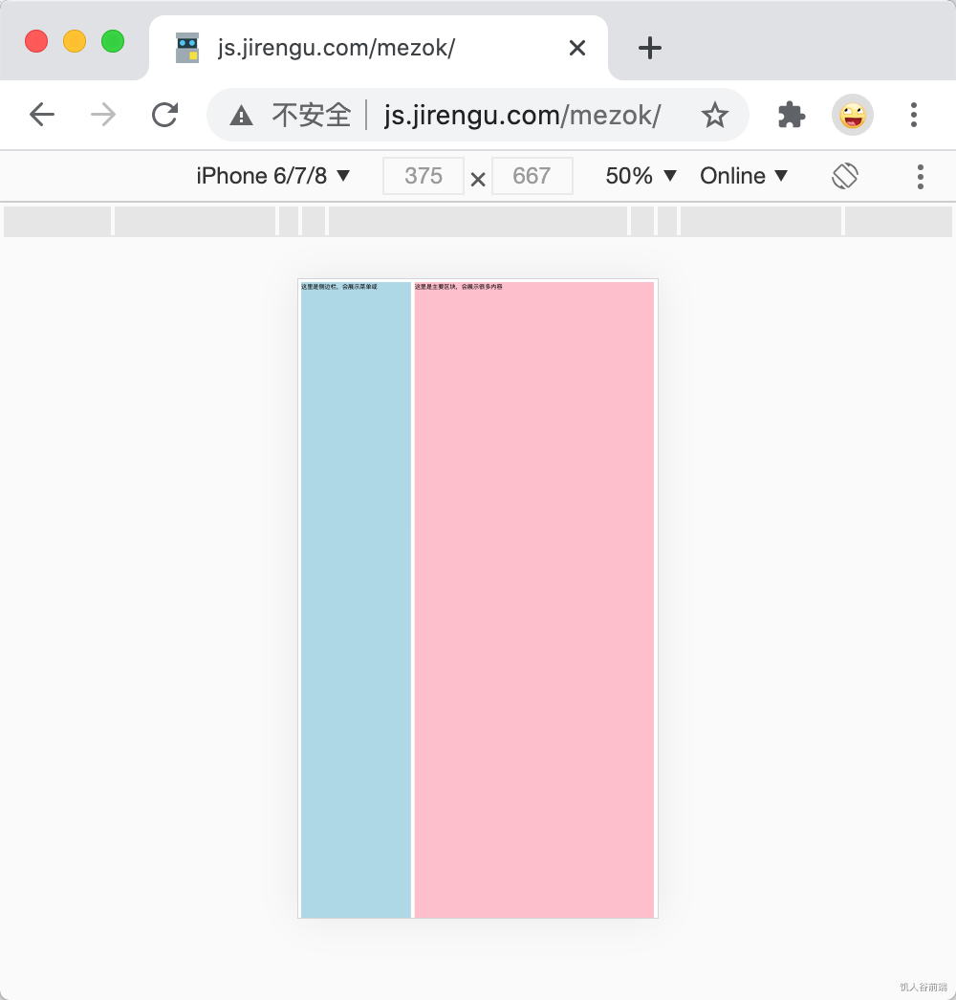
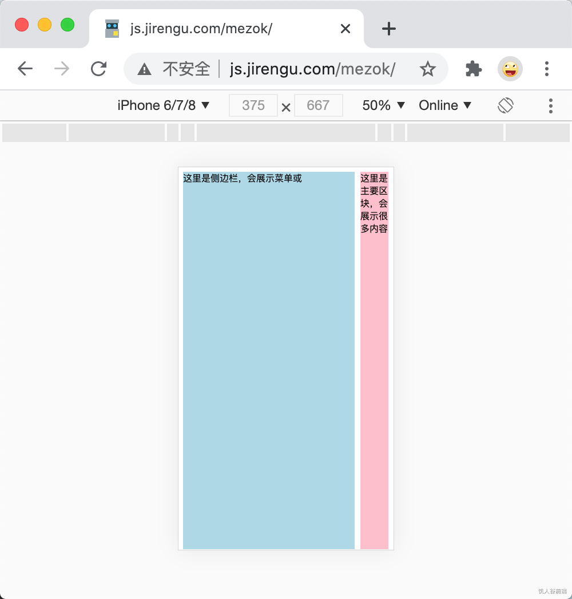

# 移动端页面为什么要加meta name="viewport" content="width=device-width"

## 回答

1. 我们页面本身是移动端设计风格的页面，设计师在设计页面时按移动端通用的375px或者428px来做设计，我们需要在head标签里加 `<meta name="viewport" content="width=device-width">`。如果原本就是针对PC浏览器设计的页面未适配过移动端，不简易加此meta。
2. 这句话的意思是让页面的布局视口的宽度等于视觉视口的宽度，此时页面元素会以设备逻辑像素宽度做为文档宽度进行布局。
3. 如果不加，则页面元素会以980px的文档宽度进行布局，然后980px的宽度再缩小填充整个屏幕。会导致页面元素看起来比较小。

## 解析

### 物理像素、逻辑像素、CSS像素

Iphone 12 Pro Max的屏幕分辨率(物理像素)是1284 x 2778，水平方向有1284个像素点，宽度仅是7.8cm。我们写的页面里给文字设置font-size: 12px (CSS像素)时，屏幕不能按照物理像素和CSS像素1:1的比例来绘制，否则文字会小到看不见。换个分辨率低的设备，文字大小又会变大很多。

这时候设备厂商发明了一个“逻辑像素”(或者叫设备独立像素)的概念。规定IPhone 12 Pro Max 水平方向的逻辑像素是428px，华为P40 pro的水平方向逻辑像素是400px。即：在默认情况下当我们给页面元素设置样式 width: 428px 时，在IPhone 12 Pro Max 正好能水平撑满整个屏幕，在华为P40 pro上会超出屏幕28px。逻辑像素的概念妥善了不同设备物理像素差异带来的页面元素尺寸展示差异过大的问题（分辨率高的设备和分辨率低的设备展现同一页面元素大小接近，只是清晰度不同）。

### 布局视口和视觉视口

思考一个问题：HTML页面的body里有很多汉字，每个文字占据的宽度是15px，这个页面分别在手机浏览器和PC浏览器上展示一行大约能展示多少汉字？

水平方向一行展示多少文字后会折行，这实际上是由默认文档宽度（布局视口，Layout Viewport）决定的。在PC浏览器，这个文档宽度等于浏览器视口（视觉视口，Visual Viewport）的宽度。假设浏览器窗口宽度是1200px，一排大约能展示80个文字。

在移动端，默认文档宽度是否也应该等于浏览器视口(即屏幕的逻辑像素宽度)呢？答案是：不一定。

场景1：我们的页面本身就是移动端设计风格的页面，设计师在设计页面时按移动端通用的375px或者428px来做设计，开发工程师也按浏览器宽度为375px或者428px来做页面布局，这种情况下我们确实希望默认的文档宽度等于浏览器视口的宽度。

场景2: 我们的页面本身就是是针对PC浏览器做的设计和排版，我们是不太希望页面按375px或者428px的最大宽度做布局。比如我们做了个后台管理系统，使用浮动做经典的PC端两栏布局，侧边栏固定宽度300px，主区域自适应一般最小宽带是600px，如果页面默认最大宽度是375px或者428px，必然导致页面主区域因容器宽度而显示过窄或者下移。在移动端展示时，希望页面的默认文档宽度仍然是一个接近1000px的宽度，在此宽度上做布局，然后缩小填充到整个屏幕上。虽然用户用手机打开页面会发现页面元素比较小，但至少不会样式错乱。

在手机展示两栏布局，不加设置viewport的meta，页面展示正常只不过页面缩小了

在手机展示两栏布局，加了设置viewport的meta，页面错乱

有没有办法能同时区分并兼顾以上两种场景呢？当然是有的。

### 设置viewport

在HTML的head标签里加上 `<meta name="viewport" content="width=device-width">` ，就告诉浏览器我是移动端页面，用的是移动端的设计，对于视口 viewport，我要把默认文档宽度 width （布局视口宽度）设置为逻辑像素宽度 device-width（视觉视口宽度、设备宽度、屏幕宽度）。适合场景1。

如果不加这个meta，那默认的文档宽度就是 980px 。适合场景2。

回到开头的问题：HTML页面的body里有很多汉字，每个文字占据的宽度是15px，这个页面分别在手机浏览器和PC浏览器上展示一行大约能展示多少汉字？以 在IPhone 12 mini (逻辑像素宽度是375px）为例，假设HTML的head标签里加了 `<meta name="viewport" content="width=device-width">` ，一排大约能展示375/15 = 25个字。假设head标签里没加这个meta，一排大约能展示980/15 = 65 个字。

分别在手机测试

- 加了meta  http://js.jirengu.com/zowec/34
- 没加meta  http://js.jirengu.com/zowec/36
