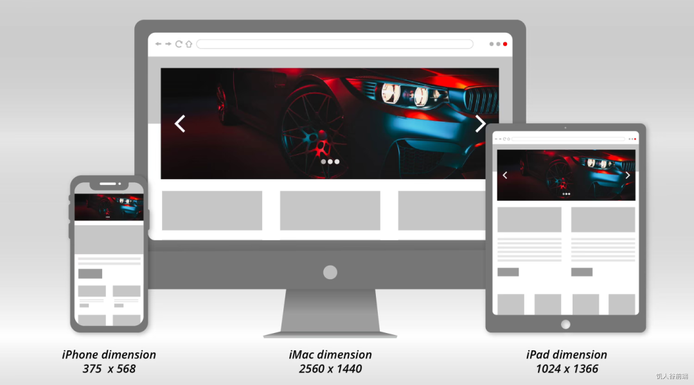
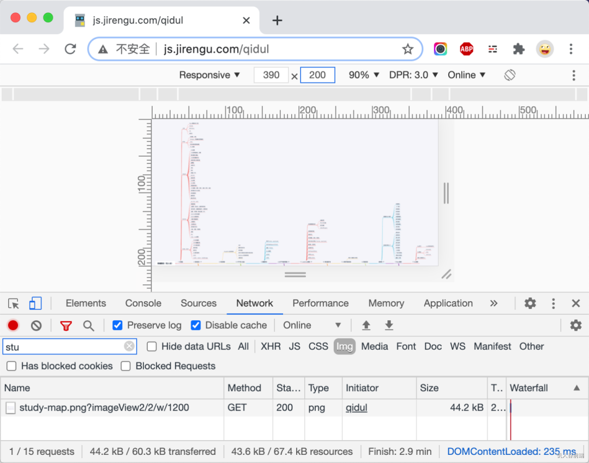
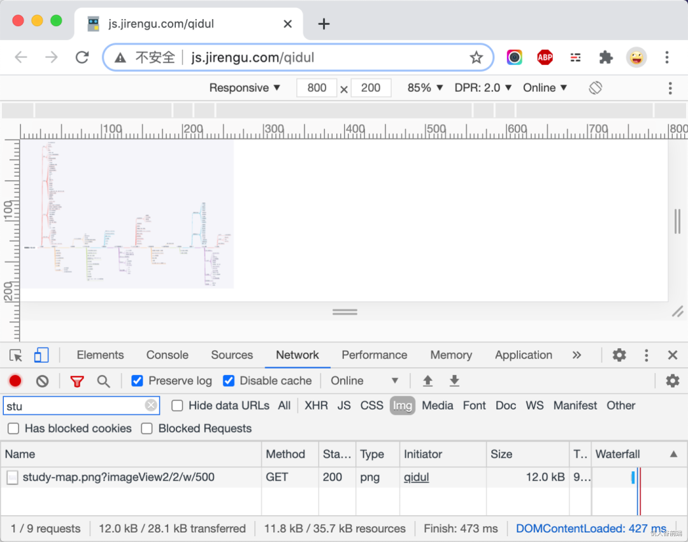
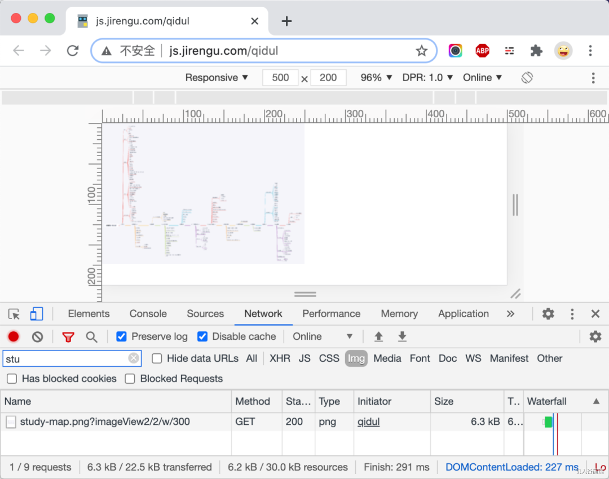

# 图片高清解决方案

## # 什么是响应式图像

响应式图像指的是根据设备分辨率、设备像素比，甚至是屏幕方向、屏幕尺寸、页面布局等来加载正确图像，并且图片体积尽可能的小，视觉效果足够高清。

一个真实的场景：用户上传了一张高清图片，这张图片的展示媒介包括27英寸的iMac、15寸的Macbook Pro、各种尺寸的平板、各种分辨率的Windows本、各种尺寸和DPR的手机，如何保证图片在不同的媒介上都足够高清、图片体积尽可能小呢？



## # 我们到底需要多大的图片

以IPhone 12 Pro为例，其分辨率(设备像素是) 1170 x 2532，逻辑像素(设备独立像素)是 390 x 844，设备像素比(DPR)是 3 。假设一张图片水平铺满屏幕，在CSS里可以设置img { width: 390px }，而图片的原始宽度至少是1170px才能保证高清显示。

换句话说，**图片的原始宽度 >= CSS里设置的宽度 x DPR** 。

那么在加载图片时如何能根据 DPR 选择合适的图片呢？

## # 不为人知的 srcset 属性

提到根据DPR加载不同图片，大家首先想到的是**利用CSS媒体查询根据不同的DPR给元素设置同一图片不同尺寸的背景图**。但这种方法**只适用于写在CSS文件里作为网站icon或者背景插图的固定不变的图片**。对于网站可变的图片比如商品大图、轮播banner、用户头像这些更需要处理的图片就无能为力了。

在工程实践中，对img标签图片的加载优化用的最多的就是**图片懒加载**（先加载一个图片占位符，等用户滚动到图片时再加载真实图片）和**图片渐进式加载**（先加载低清图片做模糊处理，之后再加载高清图片做替换）两种方案，为保证高清在加载真实图片时在尺寸上做了大量的冗余，并未做到根据不同的DPR加载高清且尺寸最小的图片。

我们可以使用 ``标签的 srcset 属性来实现。

## # 根据DPR选择图片

```html

```

以上代码的意思是：打开网页，浏览器解析到图片时，如果不支持srcset属性，默认加载image.jpg，如果支持且屏幕DPR为1 则加载 image.jpg，如果屏幕DPR为2则加载image2x.jpg，如果屏幕DPR为3则加载image_3x.jpg。

写法简单但不一定够用。

以IPhone11 (828 x 1792, DPR是2)和 Macbook Pro (2880 x 1800, DPR是2) 为例，二者的DPR相同。但如果一张图片想全屏高清展示在Macbook Pro上，实际宽度至少要是2880px，而IPhone11上只需要828px的图片即可实现高清全屏展示。

## # 根据实际需要的尺寸选择图片

换一种写法

```html

```

以上代码的意思是：如果需要实际宽度是600px的图片就加载imageS.jpg，如果需要实际宽度是2800px的图片就加载imageXL.jpg。需要实际宽度是多少该如何计算呢？

| 视口宽度(逻辑像素) | DPR | 所需图片的最终宽度 | 选择加载的图像 |
| ------------------ | --- | ------------------ | -------------- |
| 414                | 1   | 414                | image_S.jpg    |
| 414                | 2   | 828                | image_M.jpg    |
| 1440               | 1   | 1440               | image_L.jpg    |
| 1440               | 2   | 2880               | image_XL.jpg   |

浏览器会用屏幕逻辑像素的宽度(screen.width) 乘以 DPR(window.devicePixelRatio) 计算出结果，再从列表里选一个最靠近计算结果的值对应的图片。

对于上面代码，Iphone11会加载imageM.jpg，而Macbook Pro会加载 imageXL.jpg 。

以上写法适用于满屏图片的场景，而实际场景下图片并非在各个媒介都占满整个屏幕。考虑这样一种场景：比如图片在Iphone上满屏现实，在Macbook Pro 上一排展示4张图片(图片最大尺寸是屏幕的1/4)，在Macbook Pro上没必要加载3000px宽度的图片。

## # 使用sizes属性

假设这么一个场景，我们用媒体查询实现如下布局：

- 视口宽度大于900px，则每个图像的固定宽度为300px。
- 视口宽度在700px～900px，每个图像占用33vw，即总视口宽度的33％宽度。
- 视口宽度在450px～700px，每个图像占用50vw，即视口总宽度的50％。
- 视口宽度小于450像素，每个图像占用100vw，即整个视口宽度。

如何实现这种响应式布局下的图片响应式加载呢？

先写好布局对应的CSS：

```css
img{width: 300px;}

@media(max-width: 1000px){

  img{width: 33vw;}

}

@media(max-width: 700px){

  img{width: 50vw;}

}

@media(max-width: 450px){

  img{width: 100vw;}

}
```

再写HTML

```html
<html>
<head>
<meta name="viewport"content="width=device-width">
</head>

<body>


</body>
</html>
```


上面代码 sizes 属性对应的意思是：如果当前视口宽度小于450px，则当前图片宽度为100vh；如果视口宽度小于700px，则图片宽度为50vw；如果视口宽度小于1000px，则图片宽度为33vw；如果视口宽度大于1000px，则图片宽度300px。

明明在CSS里已经做了类似的设置，为什么还要在img标签里再写一遍？那是因为浏览器没办法在解析img标签时提前知道该图片在CSS里设置的布局是怎样的（假设能知道，就得要求在CSS全部解析之后才能加载图片，太迟了）。

sizes属性做了响应式设置后，浏览器就计算图片的大小，再根据DPR计算出需要加载图片的原始尺寸。从srcset里配置图片列表里选出最接近的一个执行加载。

## # 测试

打开 http://js.jirengu.com/qidul ，检查元素，设备类型选择 Responsive， 修改尺寸和DPR。

\1. 假设浏览器宽度390px，根据CSS里媒体查询设置，此时图片的CSS宽度为100vh。假设屏幕DPR为3，则需要的原始宽度为390 x 3 = 1170px。浏览器会加载 study-map.png?imageView2/2/w/1200 。



\2. 假设浏览器窗口宽度为800px，此时图片的宽度是33vw即264px。假设屏幕DPR为2，则需要的图片原始宽度为 264 x 2 = 528px。会自动选择最接近的 study-map.png?imageView2/2/w/500。



\3.  假设浏览器窗口宽度为500px，则图片的宽度是50vw即250px。假设屏幕DPR为1，则需要的图片原始宽度为 250 x 1 = 250px。会自动选择最接近的 study-map.png?imageView2/2/w/300。


