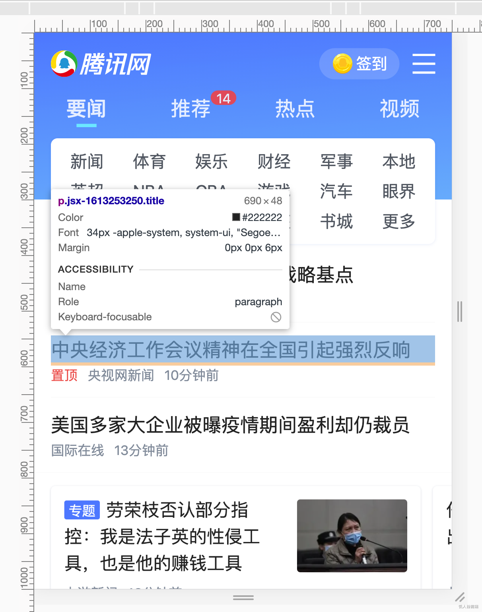
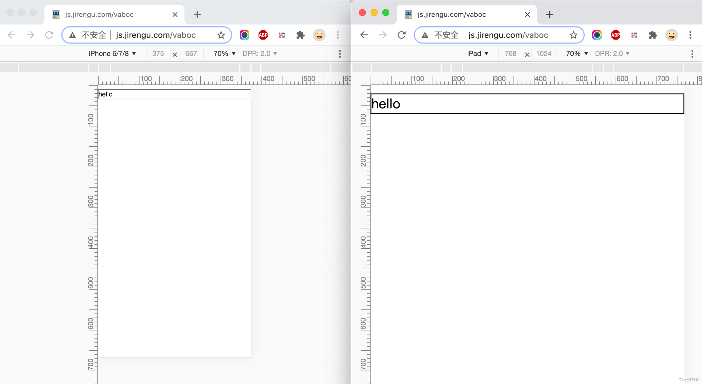

# 移动端适配viewport缩放方案

## 前言

设计师交付给前端开发一张宽度为750px的视觉稿，设计稿上元素的尺寸、颜色、位置等已做过标注，要求工程师工在适配不同屏幕尺寸的设备时采用等比缩放的方案。



采用viewport缩放的方案能又快又好的实现需求。

## 原理

在写HTML、CSS对设计稿进行还原时不关注屏幕尺寸的差异，而是直接按设计稿的标注来开发。比如设计稿里标注的文字字号是30px，CSS里就设置文字字号30px。

页面开发好后，在HTML的head标签里加入 `<meta name="viewport" content="width={设计稿宽度}, initial-scale={屏幕逻辑像素宽度/设计稿宽度}" >`  。

举个例子。假设设计师交付的设计稿宽度是750px，设计稿上一个标题字号标注的是32px 、margin是20px。我们以标注的大小来写CSS。之后需要通过JavaScript计算获取屏幕的宽度（假设需要适配逻辑像素宽度是428px的屏幕），在HTML的head里添加 `<meta name="viewport" content="width=750px, initial-scale=0.57" >` 即可（428/759 = 0.57）。

这段代码的意思是：设置布局视口(layout viewport)的宽度为750px（此时页面一般会超出屏幕），再缩放页面（initial-scale）使其恰好撑满屏幕。

## 适配代码

```html
<!DOCTYPE html>
<html>
<head>
  <meta charset="utf-8">
  <script>
    const WIDTH = 750
    const mobileAdapter = () => {
      let scale = screen.width/WIDTH
      let content = `width=${WIDTH}, initial-scale=${scale}, maximum-scale=${scale}, minimum-scale=${scale}`
      let meta = document.querySelector('meta[name=viewport]')
      if(!meta) {
        meta = document.createElement('meta')
        meta.setAttribute('name', 'viewport')
        document.head.appendChild(meta)
      } 
      meta.setAttribute('content', content)
    }
    mobileAdapter()
    window.onorientationchange = mobileAdapter
  </script>
</head>
<body>
 ...
</body>
</html>
```

## 优点与缺点

- 优点： 开发流程很简单，工程师只需根据设计稿标注还原页面，不需要额外计算。适配范围广。
- 缺点： 页面整体放大缩小，对于不想缩放的元素无法控制。比如边框在大屏手机下显得很粗，在小屏手机下显得很细（下图所示）。



我们更需要一种既能整体缩放，又能个性化控制某些元素不缩放的方案。见下篇文章：动态Rem方案。
